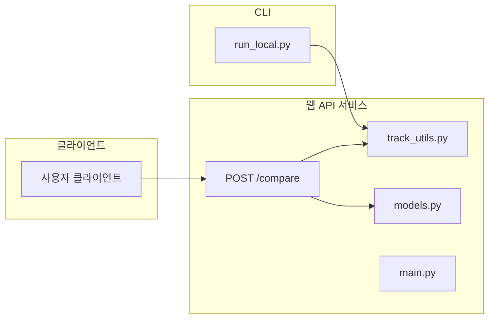
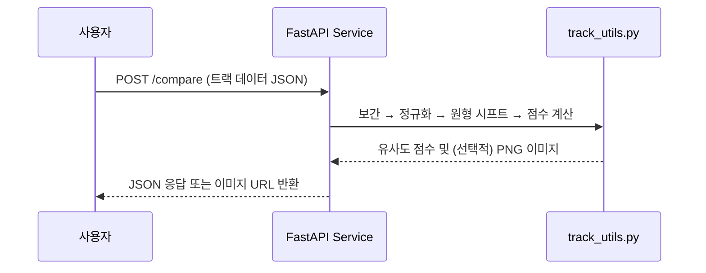

# F1 Sketch API

## 🏎️ 프로젝트 개요

F1 Sketch API는 [F1 Sketch](https://f1sketch.com)를 위하여 사용자가 그린 F1 트랙 스케치를 실제 트랙 데이터와 비교하여 유사도를 분석하고, JSON 응답 또는 시각화 이미지를 제공하는 웹 API입니다.
주요 알고리즘은 `track_utils.py`에서 4단계 파이프라인(보간 → 정규화 → 원형 시프트 → 점수 변환)으로 구성되어 있습니다.

### 핵심 기능

#### ✏️ 경로 보간 및 정규화

- 입력된 2D 경로 데이터를 100개 포인트로 선형 보간
- 중심점 이동 및 스케일 정규화를 수행 (`track_utils.py:5-19`)

#### 🔄 원형 시프트 매칭

- 최적의 시작 지점을 찾기 위해 경로를 원형으로 시프트
- 각 시프트마다 두 경로 간 유클리드 거리 합을 계산하여 최소값 탐색 (`track_utils.py:21-35`)

#### 📊 유사도 점수 계산

- 계산된 최소 거리를 시그모이드 함수에 입력해 0–100점 사이의 유사도 점수로 변환 (`track_utils.py:51-54`)

#### 🖼️ 시각화 기능

- 보간된 경로와 정규화된 경로를 `matplotlib`으로 시각화
- PNG 파일로 저장해 클라이언트에 전송 가능 (`track_utils.py:63-68`)

## 🛠️ 기술 스택

### Backend

- **Framework**: FastAPI (`main.py:5-8`)
- **데이터 검증**: Pydantic (`models.py:4-6`)

### 데이터 처리

- **NumPy**: 2D 경로 데이터 수치 연산 및 배열 처리 (`track_utils.py:3`)
- **Matplotlib**: 경로 시각화 및 PNG 이미지 생성 (`track_utils.py:61`)

### 인터페이스

- **CLI 도구**: 로컬 개발용 실행 스크립트 (`run_local.py:9-12`)
- **웹 API**: `POST /compare` 엔드포인트를 통한 JSON 응답 (`main.py:14-19`)

## 🏗️ 시스템 아키텍처





## 🌐 배포 및 접속

**웹사이트**: [f1sketch.com](https://f1sketch.com)

서비스는 현재 운영 중이며, 데스크톱과 모바일 환경 모두에서 접속 가능합니다. 다만 트랙을 그리는 기능을 모바일에서 어떻게 최적화 할 지 고민 중이기에 모바일 환경에서는 트랙 선택 및 그리기 기능이 제한되어 있습니다.

## 📋 개발 과정

### 기여도와 역할

- 프로젝트 요구사항 정의 및 개발 타임라인 관리 (Notion)
- 핵심 알고리즘 설계 및 구현 (`track_utils.py`)
- FastAPI 엔드포인트 및 Pydantic 모델링
- CLI 도구 제공으로 로컬 테스트 지원

프로젝트 기능 요구사항 정리 및 개발 타임라인은 다음 링크에서 확인할 수 있습니다:  
[프로젝트 관리 문서](https://guttural-stinger-5d4.notion.site/20caa997cf3680e18596f24354937e05?source=copy_link)

모든 기능 개발 및 배포는 개인 개발자로 진행하였습니다.

[프론트엔드 서비스](https://github.com/goosull/f1sketch_frontend)
[백엔드 서비스](https://github.com/goosull/f1sketch_backend)

## 🚀 로컬 실행

```bash
# 의존성 설치
pip install -r requirements.txt

# CLI로 테스트
python run_local.py --input sample_path.json

# 웹 서버 실행
uvicorn main:app --reload --port 8000
```

- 이후 [http://localhost:8000/docs](http://localhost:8000/docs)에서 Swagger UI를 통해 API를 확인할 수 있습니다.
